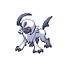
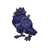

# 勝率改善に向けたパーティー候補

> 過去資料。現在構築する6匹は[ドヒドイデ構築](../toxapex-cycle.md)。このページの「推奨」は作成当時の内容です。

**2026-09-18調査／チャンピオンズ・シングル／M-C**  
[トップへ](../../README.md) ｜ [現行構築](current-team-v1.md) ｜ [対戦記録](../battle-log.md)

## おすすめの順番

**履歴用：所持写真と敗戦報告を踏まえ、現在の推奨は[v2.0](current-team-v2.md)です。** 以下のA～Cは比較用に残します。

**まず候補Aをレンタルで試すのがおすすめ。** 勝ち筋が「カバルドンで準備→ボーマンダでりゅうのまい」と明確で、現行から4匹を残せます。6匹を変えたくない場合は候補B。カバルドンや水タイプを攻撃で押したい場合は候補Cです。

| 候補 | 6匹 | 現行からの種族変更 | 位置づけ |
| --- | --- | --- | --- |
| **A：カバマンダガルド** | ボーマンダ／カバルドン／ギルガルド／グソクムシャ／アシレーヌ／サーフゴー | ロトム・ガブ→カバ・ガルド | 海外公開構築。最初に試す候補 |
| **B：先制技＋交代で削る** | グソクムシャ／ボーマンダ／ヒートロトム／ガブリアス／アシレーヌ／サーフゴー | なし | 使用傾向を参考にした独自調整。未実戦検証 |
| **C：ゴリランダー＋アブソルZ** | ゴリランダー／アブソル／アーマーガア／ガブリアス／アシレーヌ／サーフゴー | グソク・マンダ・ロトム→ゴリラ・アブソル・ガア | 海外公開構築。攻撃的な別案 |

公開構築でも、こちらで勝率を検証したわけではありません。A・Cの紹介サイトにある「Ranked 1800」や動画タイトルの「#1」は、確認できた順位・レート実績として扱いません。公開動画の勝ち試合だけで長期勝率も判断できません。

## 現行案のどこを改善するか

対戦ログがまだないため、以下は**構築を読んだ仮説**です。

- **グソクムシャの即効性**：現行は攻撃14・素早さ23で、剣舞を使わない試合では火力配分と技構成を生かしにくい。「であいがしら」で積まずに削る案を比較したい。
- **ボーマンダの勝ち筋**：現行の両刀4攻撃は相手に合わせて技を選ぶ型。「りゅうのまい＋はねやすめ」にすると役割が変わり、終盤に抜く手順を作りやすい。ただし特殊技を失って物理受けへの崩しは弱まる。
- **起点作りとエースの接続**：タスキガブのステロだけでは、必ずしも安全に積むターンは作れない。Aはあくびによる交代・眠りを利用する。
- **火力不足の切り分け**：現行の防御重視アシレーヌは切り返し役。倒し切れない負けが多いなら特攻を増やす価値があるが、物理耐久との交換になる。

海外サイト[Pokémon Zoneの9/18更新シングル集計](https://www.pokemon-zone.com/champions/ranked-seasons/singles/)では、ボーマンダのりゅうのまい72.5%・はねやすめ64.3%、グソクムシャのであいがしら70.1%・つるぎのまい20.8%を確認しました。現行と異なる型を試す根拠にはなりますが、採用率は勝率ではありません。また「海外サイトに掲載された集計」であり、海外プレイヤーだけの統計とは確認できていません。

## A：カバマンダガルド【第一候補】

| エース | 準備役 | 攻撃・補完 |
| :---: | :---: | :---: |
|  |  |  |
| ボーマンダ | カバルドン | ギルガルド |
|  |  |  |
| 別のメガ枠 | 水・妖の攻撃役 | 耐久構築への選択肢 |

**公開者：HoshinJosh／2026-09-15公開。レンタルID：`ER9UVPP1D1`。** 動画説明で確認済み。ゲーム内で現在も借りられるかは未確認です。[原動画](https://www.youtube.com/watch?v=1mwa0OBHoWE)／[6匹の掲載ページ](https://pokemonchampionsreplicateams.com/teams/1-mega-salamence-team-salamence-hippowdon-aegislash-golisopod-primarina-gholdengo-er9uvpp1d1)

### 公開者の説明で確認した設計

- カバルドンのステルスロック＋あくびから、ボーマンダのりゅうのまいにつなぐ。
- ギルガルドはアシレーヌに圧力をかける枠。のろいのおふだ＋ポルターガイストを採用。
- グソクムシャはボーマンダを出しにくい相手への別メガ。紹介技はきゅうけつ／ドリルライナー／ふいうち／ビルドアップ。
- サーフゴーは耐久寄りの相手への選択肢。動画内の対戦には最終6匹に確定する前の構成も含まれる。

**育成し直す前に、レンタル内の技・性格・配分を確認してください。** 原動画の全個体の数値は今回完全には転記していません。現行の同種ポケモンをそのまま並べても、この公開構築の再現にはなりません。

### 選出・立ち回り案（ここからは本ノートの分析）

| 相手 | 選出の出発点 | 戦い方 | 注意点 |
| --- | --- | --- | --- |
| 一般的な攻撃構築 | カバ＋マンダ＋ガルド | あくびで交代を促し、削れた相手にマンダを通す | 毎回ステロから入らない。カバがすぐ倒される対面なら攻撃・交代を優先 |
| カバマンダ＋アシレーヌ | アシレーヌ＋ガルド＋マンダ | 水技でカバを削り、相手のアシレーヌにガルドを合わせる | 相手のガルドへの交代も考える。ポルターガイストは相手の持ち物消費後に使えない |
| セグレイブ・マスカーニャ軸 | グソク＋カバ＋アシレーヌ | マンダに固定せず、グソク側をメガ枠にする | ドリルライナー型には鋼技がない。タイプ相性だけで簡単に倒せると考えない |
| 受け・変化技中心 | サーフゴー＋アシレーヌ＋メガ枠 | サーフゴーを残して相手の回復・状態異常中心の展開を崩す | あく・ほのお枠を先に削る。サーフゴーへの依存度が高い |
| ルカリオZ | カバ＋アシレーヌ＋メガ枠を検討 | 無料でわるだくみを使わせず、削って先制技圏内へ | ギルガルドを安全な受け先と決めない。あくのはどうに注意 |

**改善を期待する点**：何を残して何で倒すかを決めやすい。  
**失うもの**：スカーフロトムの速度と炎打点、タスキガブの行動保証。ちょうはつ・あくび無効・高速特殊への対応は別途必要。

## B：今の6匹を維持し、先制技と交代を増やす【独自の試験案】

     

**海外サイトの使用傾向を参考に、現行6匹向けに組み直した案。公開レンタルのコピーではなく、対戦実績・レンタルIDはありません。**

性格の **↑＝上がりやすい能力、↓＝上がりにくい能力**。能力ポイントはH＝HP、A＝攻撃、B＝防御、C＝特攻、D＝特防、S＝素早さ。下記は各66ポイントの試験用配分で、特定の攻撃を耐える計算済み調整ではありません。

| 変更対象 | 持ち物・性格 | ポイント | 技4つ |
| --- | --- | --- | --- |
| グソクムシャ | グソクムシャナイト／いじっぱり（攻撃↑・特攻↓） | H32 A32 D2 | であいがしら／アイアンヘッド／ふいうち／とんぼがえり |
| ボーマンダ | ボーマンダナイト／ようき（素早さ↑・特攻↓） | H2 A32 S32 | すてみタックル／じしん／りゅうのまい／はねやすめ |
| アシレーヌ | オボンのみ／ひかえめ（特攻↑・攻撃↓） | H32 B20 C14 | うたかたのアリア／ムーンフォース／アクアジェット／アンコール |

残り3匹の技・性格・配分・持ち物、全員の特性は[現行設定](current-team-v1.md)を使います。能力補正で弱まるアクアジェットは、削れた相手を倒す補助用です。

### 勝ち方

**ロトムのボルトチェンジ → グソクのであいがしら → 交代・とんぼがえり → 再登場して先制技**を軸に、積む前の火力を増やします。であいがしらは場に出た最初のターン限定なので、居座って連打できません。とんぼがえりを選ぶターンは、遅いグソクが先に攻撃される危険があります。

| 相手 | 選出の出発点 | 狙い・注意 |
| --- | --- | --- |
| 攻撃的な構築 | グソク＋ロトム＋アシレーヌ | 先制技とスカーフで削った相手を倒す。回復のないグソクを何度も受け出ししない |
| カバマンダ | アシレーヌ＋サーフゴー＋メガ枠 | 水技でカバを圧迫。先にサーフゴーのふうせんを割られないようにする |
| 相手のグソク中心 | ロトム＋マンダ＋アシレーヌ | 炎打点を残す。マンダの舞うターンをふいうち読みだけで決めない |
| 受け構築 | ロトム＋サーフゴー＋マンダ | トリックとわるだくみを使う。グソクの剣舞を失うため長期戦の崩しは弱まる |

**代償**：グソクのきゅうけつによる回復・剣舞の突破力、マンダの特殊打点、アシレーヌの物理耐久が減ります。先制技は、相手の先制技無効効果やまもるで止められる場合もあります。

変更の効果を見分けるなら、最初は**グソクだけ変更して10戦程度**、次に必要に応じてマンダ・アシレーヌへ進めます。B完成形の試用と、変更点の切り分けを混同しないよう記録してください。

## C：ゴリランダー＋アブソルZ【別の勝ち方を試す候補】

| 主な攻撃役 | 終盤の攻撃役 | 物理へのクッション |
| :---: | :---: | :---: |
|  |  |  |
| ゴリランダー | メガアブソルZ | アーマーガア |
|  |  |  |
| 削り・展開補助 | グラスシード | ふうせん |

**公開者：SplashPlate／2026-09-10公開。** 原動画のシングル構築です。[原動画](https://www.youtube.com/watch?v=VFqRocfjhvc)／[6匹の掲載ページ](https://pokemonchampionsreplicateams.com/teams/splashplate-s-absol-z-singles-t0pl306nht)

### 原動画から確認できた構成

- ゴリランダー：いのちのたま、つるぎのまい／グラススライダー／ウッドハンマー／10まんばりき。
- アブソル：唯一のメガ枠。メガアブソルZのかげうちを終盤に使う。
- アーマーガア：ゴツゴツメット。ガブリアス：耐久寄りの展開補助型。
- アシレーヌ：グラスシードで防御を上げ、アンコールを採用。サーフゴー：ふうせん。

公開者自身が初期の試験構築として紹介しており、上位帯での長期実績は未確認。レンタルIDと全員の性格・配分・全技は今回確認できていないため、育成用の完成表とはしていません。紹介ページのURL末尾をコードとして流用しないでください。

### 選出・立ち回り案（本ノートの分析）

| 相手 | 選出の出発点 | 戦い方・注意 |
| --- | --- | --- |
| カバルドン＋水タイプ | ゴリランダー＋アブソル＋アシレーヌ | 草打点で削り、アブソルで終盤を取る。ゴリランダーを出すだけでカバマンダ全体に有利になるわけではない |
| 物理中心 | アーマーガア＋アシレーヌ＋アブソル | ゴツメで削って終盤へ。ゴリランダーを選出しない場合、グラスシードは自力で発動できない |
| ボーマンダ・グソク中心 | アシレーヌ＋サーフゴー＋アブソルを検討 | 草技を受けて積む展開に注意。ゴリランダーを無理に出さない場合、シードの役割を失う |

**改善を期待する点**：カバルドン・水タイプへの草打点、アブソルの先制技、アーマーガアの物理への役割。  
**代償**：選出がフィールド展開に縛られやすい。グラスフィールドは接地した相手のじしん被ダメージも軽減するため、自分のガブリアスの技・選出とのかみ合いを確認する必要があります。

## 試すときの判断基準

1. **Aを同じレンタルのまままず10～20戦。** 相手6匹、自分と相手の選出、敗因を[対戦記録](../battle-log.md)へ。これは感触を見る試用で、少数戦の勝率を強さの証明にはしない。
2. 敗因を「選出で受けられない」「積む前に倒れる」「火力不足」「速度不足」「技・型の読み違い」に分ける。
3. Aで苦手が残る場合、BまたはCを同程度の条件で試す。負けるたびに全員を入れ替えず、何を改善したいかを決める。
4. 現行v1.0は比較用に残し、採用が決まってから育成表・相手別ガイドを更新する。

## 情報の範囲と出典

| 出典 | 今回の用途 | 注意 |
| --- | --- | --- |
| [公式M-C開催案内](https://champions-news.pokemon-home.com/en/page/816.html) | 対象ルールの確認 | 開催期間は2026-09-09～12-02（UTC表記） |
| [Pokémon Zone・Singles](https://www.pokemon-zone.com/champions/ranked-seasons/singles/) | 9/18更新の型・技の採用傾向 | ダブルの大会件数をシングルの標本数として使わない |
| [HoshinJosh原動画](https://www.youtube.com/watch?v=1mwa0OBHoWE) | Aの構成、説明欄のID、冒頭の設計説明 | 公開者の評価と客観的な成績は別 |
| [SplashPlate原動画](https://www.youtube.com/watch?v=VFqRocfjhvc) | Cの構成、冒頭の型説明、シングルでの使用 | シーズン序盤の試験構築 |

画像は識別用の通常姿です。メガ後のタイプ・姿の図ではありません。[画像出典](../../assets/CREDITS.md)
