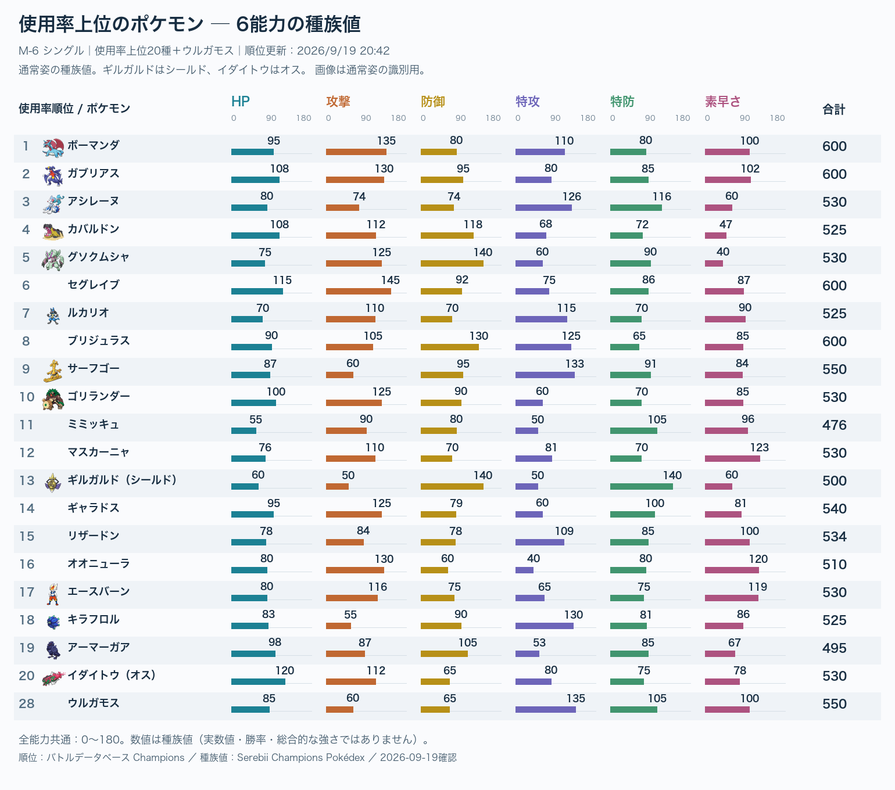
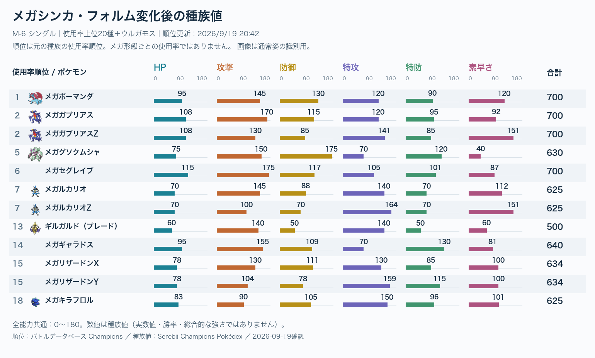

# 使用率上位の種族値グラフ

**M-6（M-C）シングル／2026-09-19確認**

[トップ](../README.md) ｜ [元データ](../data/base-stats-m6-2026-09-19.json)

## 通常姿：上位20種＋ウルガモス

## メガ・フォルム変化後

## 読み方

- 全ての棒は同じ0〜180の尺度。各能力の棒の長さと数値を比べます。合計は右端。
- 順位は[バトルデータベースのM-6シングル](https://champs.pokedb.tokyo/pokemon/list?season=6&rule=0)、サイト表示の更新日時は2026/9/19 20:42。種族単位の順位を形態にも添えており、メガ形態別の順位ではありません。
- ウルガモスは上位20種外ですが、ユーザーの対策対象として28位を追加。以前の調査時からエースバーンは18→17位、ウルガモスは27→28位へ更新。短時間の順位差だけで流行の増減は断定しません。
- 種族値は種族・姿ごとの基礎数値です。性格・能力ポイント・レベル・持ち物・特性・技によって実戦の能力は変わります。素早さ種族値だけでスカーフや竜舞後の先後は決まりません。
- 防御と特防だけで耐久は決まりません。HP・タイプ相性・特性も含めて判断します。合計が高いほど必ず強いわけではありません。
- メガ後の値は別図。ギルガルドのシールド／ブレード、イダイトウのオスを明記し、異なる姿を混同しません。

## 今の構築検討で注目したい点

- エースバーン：攻撃116・素早さ119。物理攻撃と速度が特徴。
- ウルガモス：特攻135・特防105・防御65。ただし防御育成や蝶舞、回復で実戦の硬さは変わります。
- メガルカリオZ：特攻164・素早さ151。通常ルカリオの値を使って速度比較しないこと。
- メガグソクムシャ：防御175・特防120・素早さ40。高い耐久数値でも炎4倍という相性は別に考えます。

## 数値表と出典

種族値は各リンク先のChampions版「Base Stats」から確認。画像の通常姿スプライトは[画像出典](../assets/CREDITS.md)参照。全33形態の合計と6能力を照合済み。

| 順位 | ポケモン・姿 | HP | 攻撃 | 防御 | 特攻 | 特防 | 素早さ | 合計 | 出典 |
| ---: | --- | ---: | ---: | ---: | ---: | ---: | ---: | ---: | --- |
| 1 | ボーマンダ | 95 | 135 | 80 | 110 | 80 | 100 | 600 | [図鑑](https://www.serebii.net/pokedex-champions/salamence/) |
| 2 | ガブリアス | 108 | 130 | 95 | 80 | 85 | 102 | 600 | [図鑑](https://www.serebii.net/pokedex-champions/garchomp/) |
| 3 | アシレーヌ | 80 | 74 | 74 | 126 | 116 | 60 | 530 | [図鑑](https://www.serebii.net/pokedex-champions/primarina/) |
| 4 | カバルドン | 108 | 112 | 118 | 68 | 72 | 47 | 525 | [図鑑](https://www.serebii.net/pokedex-champions/hippowdon/) |
| 5 | グソクムシャ | 75 | 125 | 140 | 60 | 90 | 40 | 530 | [図鑑](https://www.serebii.net/pokedex-champions/golisopod/) |
| 6 | セグレイブ | 115 | 145 | 92 | 75 | 86 | 87 | 600 | [図鑑](https://www.serebii.net/pokedex-champions/baxcalibur/) |
| 7 | ルカリオ | 70 | 110 | 70 | 115 | 70 | 90 | 525 | [図鑑](https://www.serebii.net/pokedex-champions/lucario/) |
| 8 | ブリジュラス | 90 | 105 | 130 | 125 | 65 | 85 | 600 | [図鑑](https://www.serebii.net/pokedex-champions/archaludon/) |
| 9 | サーフゴー | 87 | 60 | 95 | 133 | 91 | 84 | 550 | [図鑑](https://www.serebii.net/pokedex-champions/gholdengo/) |
| 10 | ゴリランダー | 100 | 125 | 90 | 60 | 70 | 85 | 530 | [図鑑](https://www.serebii.net/pokedex-champions/rillaboom/) |
| 11 | ミミッキュ | 55 | 90 | 80 | 50 | 105 | 96 | 476 | [図鑑](https://www.serebii.net/pokedex-champions/mimikyu/) |
| 12 | マスカーニャ | 76 | 110 | 70 | 81 | 70 | 123 | 530 | [図鑑](https://www.serebii.net/pokedex-champions/meowscarada/) |
| 13 | ギルガルド（シールド） | 60 | 50 | 140 | 50 | 140 | 60 | 500 | [図鑑](https://www.serebii.net/pokedex-champions/aegislash/) |
| 14 | ギャラドス | 95 | 125 | 79 | 60 | 100 | 81 | 540 | [図鑑](https://www.serebii.net/pokedex-champions/gyarados/) |
| 15 | リザードン | 78 | 84 | 78 | 109 | 85 | 100 | 534 | [図鑑](https://www.serebii.net/pokedex-champions/charizard/) |
| 16 | オオニューラ | 80 | 130 | 60 | 40 | 80 | 120 | 510 | [図鑑](https://www.serebii.net/pokedex-champions/sneasler/) |
| 17 | エースバーン | 80 | 116 | 75 | 65 | 75 | 119 | 530 | [図鑑](https://www.serebii.net/pokedex-champions/cinderace/) |
| 18 | キラフロル | 83 | 55 | 90 | 130 | 81 | 86 | 525 | [図鑑](https://www.serebii.net/pokedex-champions/glimmora/) |
| 19 | アーマーガア | 98 | 87 | 105 | 53 | 85 | 67 | 495 | [図鑑](https://www.serebii.net/pokedex-champions/corviknight/) |
| 20 | イダイトウ（オス） | 120 | 112 | 65 | 80 | 75 | 78 | 530 | [図鑑](https://www.serebii.net/pokedex-champions/basculegion/) |
| 28 | ウルガモス | 85 | 60 | 65 | 135 | 105 | 100 | 550 | [図鑑](https://www.serebii.net/pokedex-champions/volcarona/) |
| 1 | メガボーマンダ | 95 | 145 | 130 | 120 | 90 | 120 | 700 | [図鑑](https://www.serebii.net/pokedex-champions/salamence/) |
| 2 | メガガブリアス | 108 | 170 | 115 | 120 | 95 | 92 | 700 | [図鑑](https://www.serebii.net/pokedex-champions/garchomp/) |
| 2 | メガガブリアスZ | 108 | 130 | 85 | 141 | 85 | 151 | 700 | [図鑑](https://www.serebii.net/pokedex-champions/garchomp/) |
| 5 | メガグソクムシャ | 75 | 150 | 175 | 70 | 120 | 40 | 630 | [図鑑](https://www.serebii.net/pokedex-champions/golisopod/) |
| 6 | メガセグレイブ | 115 | 175 | 117 | 105 | 101 | 87 | 700 | [図鑑](https://www.serebii.net/pokedex-champions/baxcalibur/) |
| 7 | メガルカリオ | 70 | 145 | 88 | 140 | 70 | 112 | 625 | [図鑑](https://www.serebii.net/pokedex-champions/lucario/) |
| 7 | メガルカリオZ | 70 | 100 | 70 | 164 | 70 | 151 | 625 | [図鑑](https://www.serebii.net/pokedex-champions/lucario/) |
| 13 | ギルガルド（ブレード） | 60 | 140 | 50 | 140 | 50 | 60 | 500 | [図鑑](https://www.serebii.net/pokedex-champions/aegislash/) |
| 14 | メガギャラドス | 95 | 155 | 109 | 70 | 130 | 81 | 640 | [図鑑](https://www.serebii.net/pokedex-champions/gyarados/) |
| 15 | メガリザードンX | 78 | 130 | 111 | 130 | 85 | 100 | 634 | [図鑑](https://www.serebii.net/pokedex-champions/charizard/) |
| 15 | メガリザードンY | 78 | 104 | 78 | 159 | 115 | 100 | 634 | [図鑑](https://www.serebii.net/pokedex-champions/charizard/) |
| 18 | メガキラフロル | 83 | 90 | 105 | 150 | 96 | 101 | 625 | [図鑑](https://www.serebii.net/pokedex-champions/glimmora/) |
