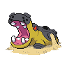
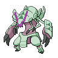
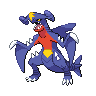
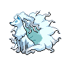
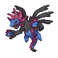
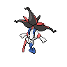
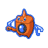
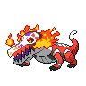
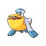
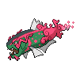

# 相手構築別の対戦ガイド

[トップへ](../README.md) ｜ [育成設定](current-team.md)

**対象：現行案 v1.0／2026-09-15。選出・立ち回りは実戦未検証の運用仮説です。**

相手の「軸」だけで選出を決めず、残りのポケモンとメガ候補も確認します。下の「想定コア」は相手の中心2〜3匹で、相手が必ずその3匹を出すという意味ではありません。「警戒度」はこちらの対処の難しさの目安で、勝率ではありません。

## 選出の早見表

| 相手の軸 | 警戒度 | こちらの選出候補 | 初手候補 | 最後まで残したいもの |
| --- | --- | --- | --- | --- |
| カバルドン＋ボーマンダ | 高 | アシレーヌ＋ヒートロトム＋ボーマンダ | アシレーヌ | アシレーヌのHP、ロトムの速さ |
| グソクムシャ＋水の補完 | 中〜高 | ボーマンダ＋ヒートロトム＋アシレーヌ | ロトム／アシレーヌ | 炎技を撃てる1匹 |
| ルカリオZ＋起点作り | 高 | ガブリアス＋ヒートロトム＋メガ枠 | ガブリアス | スカーフ、可能ならタスキ |
| ムクホーク＋壁 | **高・重点課題** | ボーマンダ＋ヒートロトム＋アシレーヌ | ロトム／ボーマンダ | メガ済みマンダ、HPのあるアシレーヌ |
| フラエッテ＋交代技 | 中〜高 | グソクムシャ＋ヒートロトム＋サーフゴー | ロトム | 鋼打点と炎打点の両方 |
| 耐久・状態異常中心 | 相手の型次第 | サーフゴー＋ヒートロトム＋グソクムシャ | ロトム／サーフゴー | トリックを使う機会、崩し役 |
| 雨＋高速水アタッカー | **高・重点課題** | アシレーヌ＋グソクムシャ＋ヒートロトム | ロトム／アシレーヌ | アシレーヌのHP、雨の残りターン把握 |
| セグレイブ＋起点作り | 高 | アシレーヌ＋グソクムシャ＋ガブリアス | アシレーヌ／ガブリアス | アシレーヌのHP、鋼技 |

## 1. カバルドン＋ボーマンダ：展開を無料で許さない

  

**確認できた相手の例**：公開記事の基本選出はカバルドン＋メガボーマンダ＋サーフゴー。別選出にキラフロル＋アシレーヌ＋メガルカリオZも掲載されています。[公開構築](https://gamewith.jp/pokemon-champions/555537)

- **相手の狙い**：ステロ・あくびで交代を誘い、マンダが積む隙を作る。
- **こちらの順序**：アシレーヌでカバルドンに水技の圧力 → マンダが出るときにHPを残す → ロトムや自分のマンダで攻め切る。
- **初手の分岐**：カバ対面なら水技を基本候補に。交代先が見えたら技を調整。相手マンダ対面ではムーンフォースを軸にし、積みを読む場合だけ耐える見込みのあるアンコール。
- **相手の裏がサーフゴー**：こちらのフェアリー技・アンコールへ出てくる可能性を考え、ロトムを残す。
- **避ける行動**：ロトムとマンダをステロの上で何度も交代させる。積んだ相手マンダをスカーフロトムが必ず抜けると思う。
- **ルカリオZもいる場合**：相手のメガ選択が不明。ロトムを優先して残し、ガブリアス採用も比較する。マンダ対策だけに3枠を使わない。

## 2. メガグソクムシャ：炎を撃つ前の状況を作る

  

**想定コア**：メガグソクムシャ＋アシレーヌ／ウォッシュロトム＋ガブリアス。共有会話の公開構築や同時採用を意識した練習用の想定です。

- **こちらの選出**：ボーマンダ＋ロトム＋アシレーヌ。地面の初手が濃ければアシレーヌから入る。
- **勝ち筋**：相手の水枠を電気・フェアリー等で削り、グソクムシャに炎技を通す。炎技持ちを2匹選んでも、両方のHPを同時に失わない。
- **ロトム対グソクムシャ**：攻撃できる状況なら炎技。ただし相手のふいうち圏内か、炎を受ける裏がいるかを見る。
- **マンダ対グソクムシャ**：だいもんじを主な突破手段にする。雨・特防厚め・命中外しまで含め、ロトムを第二の手段として残す。
- **避ける行動**：アシレーヌを安定した受けとして鋼技に投げる。地面が残る相手へ無条件にボルトチェンジする。
- **原案で改善を狙った点**：自分のグソクムシャを選ぶ試合ではアイアンヘッドで相手アシレーヌを狙える。ただし今回の対グソクムシャ選出では、メガ枠はマンダを優先する。

## 3. メガルカリオZ：スカーフとタスキを先に消費しない

  

**想定コア**：ルカリオZ＋カバルドン等の起点作り＋アシレーヌ。通常メガかZかで相手の速さ・受け方が変わります。

- **こちらの選出**：ガブリアス＋ロトム＋相手の残りに強いメガ1匹。
- **初手ガブ対Z**：じしんで負荷をかける候補を優先。ステロを置いてわるだくみを許す展開を避ける。
- **ガブが倒されたら**：ロトムで切り返す。原案のスカーフロトムはS226で、S上昇なしの最速Zの223より速い。
- **攻撃の選び方**：Zの特性は接触技の被ダメージを半減。じしん・オーバーヒートは非接触のため、その半減を受けない。[特性と能力値](https://gamewith.jp/pokemon-champions/574463)
- **危険な分岐**：相手に追い風などの速度補助、先制技、炎受けへの交代がある。速さが勝ることと確実に倒せることを分ける。
- **避ける行動**：処理前のトリック、ロトムの不用意な後出し、タスキが消えたガブを確実な停止役と考える。

## 4. メガムクホーク＋壁：この6匹の重点課題

  

**想定コア**：共有会話の過去案にあるキュウコン＋ムクホーク＋サザンドラ。現時点の流行上位と断定した並びではありません。

- **相手の狙い**：壁で初動を守り、メガムクホークのインファイトで防御・特防を上げる。
- **初手キュウコンを読む**：ロトムの炎技などで圧力をかける。壁が張られたら、その残りターンと相手の耐久上昇を追う。
- **対ムクホーク**：耐久が上がる前にマンダの飛行打点、ロトムの電気打点で攻める。回復を読むアンコールはアシレーヌのHPと先後関係次第。
- **絶対に注意**：メガ後のあまのじゃくに、未メガマンダの威嚇を入れると相手の攻撃が上がる。がんせきふうじも相手の素早さを上げる。[特性](https://gamewith.jp/pokemon-champions/564153)
- **既に何段階も上がったら**：この6匹には安定した受け直しを期待しにくい。ロトムの10まんボルト一発で解決する想定を捨て、回復拘束・残りHPからの攻撃を検討する。
- **見直し候補**：対戦記録で同じ負け方が続くなら、ラウドボーン等の採用を比較。ただし誰を外すかで失う役割まで検証してから変更する。

## 5. メガフラエッテ＋交代技：鋼役と炎役を分担

  

**想定コア**：共有会話の別候補・フラエッテ＋ハッサム＋ヒスイダイケンキ。ロトムやマフォクシーへの選出変更も考える。

- **こちらの選出**：グソクムシャ＋ロトム＋サーフゴーが出発点。
- **勝ち筋**：ハッサムにロトムの炎を合わせ、フラエッテへグソクムシャの物理鋼打点を残す。特殊耐久が上がる前ならサーフゴーからも攻める。
- **分岐**：相手がメガマフォクシーを選ぶ可能性が高いなら、この選出は炎に寄って弱い。サーフゴー→アシレーヌ等を比較し、メガ候補を見て決める。
- **避ける行動**：フラエッテへのトリック、めいそうを積ませた後に特殊技だけで突破しようとすること。
- **交代戦**：相手の交代技で狙った対面が逃げる。相手の鋼受け・炎受けを先に削り、グソクムシャが攻撃できる終盤を作る。

## 6. 耐久・状態異常：崩す相手を先に決める

 

**想定**：回復技・状態異常・物理受けを組み合わせた構築。特定の公開6匹を指すものではありません。

- **こちらの選出**：サーフゴー＋ロトム＋グソクムシャ。炎受けが重ければアシレーヌへの差し替えも比較。
- **勝ち筋**：一般枠の回復役をトリックで拘束 → サーフゴーが積んで崩す → 残りをグソクムシャで回収。
- **分岐**：ラウドボーンなどの「てんねん」に、積みだけで突破する計画を立てない。相手のタイプ・HP・回復手段を見て技を通す。
- **避ける行動**：相手がメガストーン持ちなのにトリックする。サーフゴーを炎・悪・ゴースト攻撃に何度も後出しする。
- **判断の基準**：どの1匹を倒せばエースが通るかを決める。全員を少しずつ削るだけでは相手の回復が追いつく。

## 7. 雨構築：水の受け先不足を意識する

 

**想定コア**：ペリッパー＋雨で速くなる水アタッカー。流行順位を確認した並びではなく、この構築の弱点を試すための想定です。

- **こちらの選出候補**：アシレーヌ＋グソクムシャ＋ロトム。
- **相手ペリッパー初手を読む**：ロトムの電気で圧力。ただし相手の地面への交代を確認し、ロトムが強化された水技を受ける展開を避ける。
- **中盤**：雨の残りターンを数え、アシレーヌのHPを使い切らない。ロトムは受け役ではなく、安全に出して攻撃する役。
- **終盤**：相手をふいうちの範囲に削る。相手が補助技や先制技を使う可能性も考える。
- **避ける行動**：スカーフなら雨エースより速いと決めつける。雨下でも炎技でグソクムシャを同じように倒せると考える。自分のメガグソクムシャを水半減と誤認する。
- **限界**：安全に雨ターンを消費できる保証はない。繰り返し負けるなら水耐性・天候への対応をメンバー変更の優先項目にする。

## 8. セグレイブ＋起点作り：氷への弱点を重ねない

**想定コア**：セグレイブ＋カバルドン等の起点作り。セグレイブは9/14のシングル順位で6位。詳細な型とメガ後の仕様は次の調査項目です。[集計元](https://pokest.com/)

- **こちらの選出候補**：アシレーヌ＋グソクムシャ＋ガブリアス。ガブは氷技への受けではなく、相手の起点作りへの圧力・削り役。
- **勝ち筋**：アシレーヌのフェアリー打点とグソクムシャの鋼打点を残し、積む前に削る。
- **分岐**：積み読みアンコールは耐えられるときだけ。連続技がある場合、タスキのガブを確実な停止役にしない。
- **避ける行動**：ボーマンダとガブリアスを、理由なくセットで選んで氷技を一貫させる。
- **次に詰める点**：技・持ち物・メガ後タイプ・素早さ・耐久配分を確認してから、確定したダメージや行動順を追記する。

## 共通の勝ち方

**選出時に倒すべき相手を決める → 補助役・ロトムで削る → エースを安全に出す → 積む必要があるか判断 → 攻撃・先制技で取り切る。**

「安全に出す」は、味方が倒された直後や相手の交代・拘束技に合わせること。タイプが有利なだけで無条件に後出しできるという意味ではありません。
