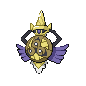
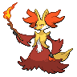

# 共有調査の整理・原案の記録

[トップへ](../README.md)

原資料：[共有会話「ポケモンパーティ提案」](https://chatgpt.com/share/6aa95738-ba9c-83e9-84e5-514de5e5e00a)。2026-09-15に読めた回答を整理。会話中の調査基準日は2026-09-13です。

## 結論が変わった流れ

| 段階 | 提案 | 次の案へつながった論点 |
| --- | --- | --- |
| 最初の再考 | グソクムシャ軸／ルカリオZ＋マンダ／ムクホーク軸の3候補 | 個別対策だけでなく「選んだ3匹の勝ち方」を重視 |
| ゼロから再考 | 公開のグソクムシャ＋両刀マンダを第一候補、フラエッテを別候補 | 両刀による崩し、交代戦との比較 |
| 最後の独自調整 | 鋼技グソクムシャ＋両刀マンダ＋スカーフヒートロトム | 対アシレーヌの打点、高速相手への切り返しを改善する狙い |

**現在の基準は最後の案。** 公開案より高勝率であることや、誰も使っていない組み合わせであることは証明されていません。

## 最終原案の固定記録

以下を初期値として保存します。今後の変更は [現行パーティー](current-team.md) に反映し、この表は原案として残します。能力ポイント順は **H-A-B-C-D-S**。

| 名前 | 性格／持ち物 | 能力ポイント | 技 |
| --- | --- | --- | --- |
| グソクムシャ | いじっぱり／グソクムシャナイト | 29-14-0-0-0-23 | アイアンヘッド・きゅうけつ・ふいうち・つるぎのまい |
| ボーマンダ | むじゃき／ボーマンダナイト | 0-19-0-15-0-32 | すてみタックル・りゅうせいぐん・だいもんじ・じしん |
| ヒートロトム | おくびょう／こだわりスカーフ | 2-0-0-32-0-32 | オーバーヒート・10まんボルト・ボルトチェンジ・トリック |
| ガブリアス | ようき／きあいのタスキ | 1-32-1-0-0-32 | じしん・がんせきふうじ・ドラゴンテール・ステルスロック |
| アシレーヌ | ずぶとい／オボンのみ | 32-0-32-1-0-1 | うたかたのアリア・ムーンフォース・アクアジェット・アンコール |
| サーフゴー | ひかえめ／ふうせん | 22-0-0-32-0-12 | ゴールドラッシュ・シャドーボール・わるだくみ・じこさいせい |

## 一つ前の公開案との違い

  →  

公開チームID **6T3J4Q1JBN** は共有会話に載っていた旧案のIDです。現在も利用できるか、公開者が更新していないかは未確認。

| 枠 | 旧公開案 | 最後の独自案 | 得たもの／失ったもの |
| --- | --- | --- | --- |
| グソクムシャ | インファイト採用 | アイアンヘッド採用 | フェアリー打点／格闘打点を失う |
| ボーマンダ | 両刀4攻撃 | 両刀4攻撃を維持、配分を指定 | 特殊火力の基準を明示 |
| ゴースト枠 | タスキ剣舞ギルガルド | 風船・悪巧みサーフゴー | 変化技対策と回復／かげうちを失う |
| ロトム | ウォッシュ・カゴ・悪巧み＋眠る | ヒート・スカーフ | 速さと炎打点／水への交代先が減る |
| ガブリアス | しんちょう・特防重視・オボン | ようきAS・タスキ | 行動機会と速さ／特殊への耐久を失う |
| アシレーヌ | ひかえめ・残飯・HB重視 | ずぶといHB・オボン | 物理耐久と即時回復／特殊火力が低下 |

## 別候補：フラエッテ＋マフォクシー

  

共有会話に記載された公開チームID：**2M2GXU199S**（現時点の有効性未確認）。

| ポケモン | 持ち物 | 技 |
| --- | --- | --- |
| フラエッテ〈えいえんのはな〉 | フラエッテナイト | ムーンフォース／ドレインキッス／めいそう／こうごうせい |
| マフォクシー | マフォクシナイト | オーバーヒート／サイコキネシス／わるだくみ／アンコール |
| ハッサム | オボンのみ | バレットパンチ／とんぼがえり／はたきおとす／はねやすめ |
| ウォッシュロトム | たべのこし | ハイドロポンプ／ボルトチェンジ／おにび／ひかりのかべ |
| ガブリアス | きあいのタスキ | じしん／ドラゴンテール／がんせきふうじ／ステルスロック |
| ヒスイダイケンキ | こだわりスカーフ | ひけん・ちえなみ／シェルブレード／クイックターン／せいなるつるぎ |

基本選出はヒスイダイケンキ＋ハッサム＋メガフラエッテ。交代技と設置技で削り、フラエッテが瞑想・回復する隙を作る。鋼が重いときはマフォクシー選出を比較する。性格・全員の正確な配分はこの回答にはないため、補完せず未記載のままとします。

## 初期の3候補も残す

| 候補 | 6匹 | 基本選出・方針 | 当時の課題 |
| --- | --- | --- | --- |
| グソクムシャ軸 | グソクムシャ／ガブリアス／ヒートロトム／アシレーヌ／サーフゴー／ラウドボーン | ガブ＋ロトム＋グソクムシャ。削りから剣舞・先制技 | 炎役のHP管理、ステロ |
| ルカリオZ＋マンダ | ルカリオ／ボーマンダ／カバルドン／ヒートロトム／アシレーヌ／サーフゴー | カバ＋メガ1匹＋補完。物理・特殊のメガを選ぶ | 起点と選出判断、マンダの回復なし |
| ムクホーク軸 | ムクホーク／アローラキュウコン／キラフロル／サザンドラ／ラウドボーン／サーフゴー | キュウコン＋ムクホーク＋サザンドラ。壁から攻める | ゴースト・物理受け、壁役2匹選出による火力不足 |

初期案の細かな育成表は原会話を参照。最後の案と混ぜて「現行設定」にしないこと。
