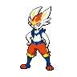

# 画像を参考にしたエースバーン・水タイプの構築候補

[トップへ](../README.md) ｜ [以前のエースバーン案・公開レンタル](cinderace-teams.md)

**2026-09-20／Champions・シングル M-C。3案とも全6匹を掲載。**

まず試すなら、回復役を2匹確保できる **A**。画像1の威嚇サイクルを重視するなら **B**、画像2と同じ6匹・持ち物を使うなら **C**。これは相性と役割から作った候補で、実戦勝率・確定耐えは未検証。画像だけで元構築の強さや隠れた設定は断定しません。

| エースバーン | 回復・積み対策 | 草打点・交代 |
| :---: | :---: | :---: |
|  |  |  |

A案で水3匹を支えるポケモン。画像は通常姿の識別用。[画像出典](../assets/CREDITS.md)

## 画像で確認できる内容

| 画像 | 左側の6匹と持ち物 | 選出表示 |
| --- | --- | --- |
| 1枚目 | ボーマンダ：ボーマンダナイト／エンペルト：オボンのみ／キラフロル：きあいのタスキ／ガブリアス：ガブリアスナイトZ／ギャラドス：ゴツゴツメット／アシレーヌ：たべのこし | エンペルト → ボーマンダ → アシレーヌ |
| 2枚目 | エースバーン：こうかくレンズ／セグレイブ：セグレイブナイト／ニンフィア：いのちのたま／ギャラドス：ギャラドスナイト／サーフゴー：たべのこし／ラグラージ：オボンのみ | エースバーン → ラグラージ。3匹目は未選択 |

**確認できないもの：技・性格・特性・配分・レンタルID・成績。以下の育成設定はすべてこちらの提案です。** 2枚目の表示名は「シグマ」ですが、画像だけでは投稿者のアカウントまで特定していません。IDは未確認であり、作りません。

## 3案の違い

| 案 | 全6匹 | 回復技を持つポケモン | 使い方・注意 |
| --- | --- | --- | --- |
| A：4匹同時採用 | エースバーン／エンペルト／ギャラドス／ラグラージ／ゴリランダー／ラウドボーン | エンペルト・ラウドボーン | 水3匹を毎試合出さず、必要な役割を選ぶ。草・高速特殊に注意 |
| B：画像1の威嚇サイクル | エースバーン／エンペルト／ギャラドス／ボーマンダ／ガブリアス／ゴリランダー | エンペルト・ボーマンダ | 通常ギャラドスで物理を削り、メガ枠は相手で選ぶ。電気と氷の一貫に注意 |
| C：画像2の6匹を再現 | エースバーン／セグレイブ／ニンフィア／ギャラドス／サーフゴー／ラグラージ | サーフゴー | 持ち物まで画像通り。細部は推定ではなく独自設定。素早さ上昇後の相手に注意 |

H＝HP、A＝攻撃、B＝防御、C＝特攻、D＝特防、S＝素早さ。配分は**Championsの能力ポイント（各32以下・合計66）**。↑は上がりやすい能力、↓は上がりにくい能力。メガ石を2匹に持たせる案でも、1試合でメガシンカするのは1匹です。

## A：4匹を使い分ける回復サイクル【最初の試用候補】

画像1のエンペルトと画像2のラグラージを参考に、エースバーンで速さ、メガギャラドスで崩し、ゴリランダーで水への圧力、ラウドボーンで積みへの対処を補います。

| ポケモン | 持ち物 | 特性（メガ前 → 後） | 性格と補正 | H/A/B/C/D/S | 4技 |
| --- | --- | --- | --- | --- | --- |
| エースバーン | こだわりスカーフ | リベロ | いじっぱり（攻撃↑・特攻↓） | 2/32/0/0/0/32 | かえんボール／とびひざげり／ダストシュート／とんぼがえり |
| エンペルト | オボンのみ | かちき | おだやか（特防↑・攻撃↓） | 32/0/2/0/32/0 | なみのり／れいとうビーム／クイックターン／はねやすめ |
| ギャラドス → メガ | ギャラドスナイト | いかく → かたやぶり | ようき（素早さ↑・特攻↓） | 2/32/0/0/0/32 | たきのぼり／かみくだく／りゅうのまい／ちょうはつ |
| ラグラージ | ゴツゴツメット | げきりゅう | わんぱく（防御↑・特攻↓） | 32/0/32/0/2/0 | じしん／ステルスロック／あくび／クイックターン |
| ゴリランダー | きせきのタネ | グラスメイカー | いじっぱり（攻撃↑・特攻↓） | 32/32/0/0/0/2 | グラススライダー／ウッドハンマー／はたきおとす／とんぼがえり |
| ラウドボーン | たべのこし | てんねん | おだやか（特防↑・攻撃↓） | 32/0/2/0/32/0 | フレアソング／シャドーボール／おにび／なまける |

### 各枠の仕事と選出

- **エースバーン**：先手のとんぼがえりで対面を動かす。スカーフで技が固定されるので、炎技を水に連打しない。リベロは場に出るたび1回発動。
- **エンペルト**：特殊の水・氷・妖へ出し、はねやすめで回復。攻撃を受けてからクイックターンで味方を出す。炎・草は等倍で、万能な特殊受けではない。
- **ギャラドス**：メガ前の威嚇を活かし、交代を誘った場面で竜舞。ちょうはつで回復・あくびを止める。メガ前の地面無効を残す判断も大切。
- **ラグラージ**：電気無効、ステロ・あくびで交代を促す役。エンペルトにオボンを渡すためゴツメ採用。回復技がなく消耗するため、受け続ける役ではない。
- **ゴリランダー**：水への圧力とグラススライダーによる締め。交代先にとんぼがえり。草場では接地相手への味方のじしんも半減する。
- **ラウドボーン**：てんねんで積みを無視し、なまけるで粘る。ちょうはつ・高火力の弱点攻撃・かたやぶりには頼れない。

| 相手・状況 | 選出の出発点 | 進め方 |
| --- | --- | --- |
| 迷ったとき | エースバーン＋エンペルト＋ギャラドス | とんぼ／クイックターンで削り、ギャラドスで締める。相手に電気がいるならラグラージへの変更を検討 |
| ウルガモスがいる | エースバーン＋ラウドボーン＋エンペルト | ラウドボーンを温存し、積み始めに合わせる。エンペルト単独受けにはしない。身代わり・挑発や型によって崩される |
| インテレオンなど高速の水 | エンペルト＋ゴリランダー＋エースバーン | 水・氷をエンペルトで確認し、草先制技またはスカーフで処理。挑発されたら回復に固執せず攻撃・交代。急所火力への確定耐えは未計算 |
| 電気主体 | ラグラージ＋エースバーン＋ギャラドス | 電気をラグラージで遮断し、草をエースバーンへ。草技読みは必要。ウォッシュロトムはふゆうなのでじしんで倒せない |
| カバルドンなど回復・あくび | ギャラドス＋エンペルト＋エースバーン | ギャラドスの挑発から展開。既にあくびを受けた後の挑発では眠気を解除できない |

**弱点：** 水3匹の同時選出は基本にしない。ラグラージは草4倍、メガギャラドスは草2倍。草への交代先2匹を両方削られると苦しい。回復役を毎試合2匹出す構築ではなく、相手に合う1匹と攻める2匹を選ぶ。

## B：エンペルト＋通常ギャラドスの威嚇サイクル

画像1のキラフロル・アシレーヌをエースバーン・ゴリランダーへ変更。ギャラドスはメガにせず、威嚇とゴツメを繰り返し使います。

| ポケモン | 持ち物 | 特性（メガ前 → 後） | 性格と補正 | H/A/B/C/D/S | 4技 |
| --- | --- | --- | --- | --- | --- |
| エースバーン | こだわりスカーフ | リベロ | いじっぱり（攻撃↑・特攻↓） | 2/32/0/0/0/32 | かえんボール／とびひざげり／ダストシュート／とんぼがえり |
| エンペルト | オボンのみ | かちき | おだやか（特防↑・攻撃↓） | 32/0/2/0/32/0 | なみのり／ステルスロック／クイックターン／はねやすめ |
| ギャラドス（通常） | ゴツゴツメット | いかく | わんぱく（防御↑・特攻↓） | 32/0/32/0/2/0 | たきのぼり／でんじは／ちょうはつ／ほえる |
| ボーマンダ → メガ | ボーマンダナイト | いかく → スカイスキン | ようき（素早さ↑・特攻↓） | 2/32/0/0/0/32 | すてみタックル／じしん／りゅうのまい／はねやすめ |
| ガブリアス → メガZ | ガブリアスナイトZ | さめはだ → ふゆう | おくびょう（素早さ↑・攻撃↓） | 2/0/0/32/0/32 | りゅうせいぐん／だいちのちから／かえんほうしゃ／パワージェム |
| ゴリランダー | きせきのタネ | グラスメイカー | いじっぱり（攻撃↑・特攻↓） | 32/32/0/0/0/2 | グラススライダー／ウッドハンマー／はたきおとす／とんぼがえり |

### 選出と動かし方

- **基本：エンペルト＋ギャラドス＋メガボーマンダ。** 特殊にエンペルト、物理にギャラドスを合わせて削り、マンダで竜舞。画像1に近い動きだが、この3匹では電気が重い。
- **鋼が厚い相手：エースバーン＋エンペルト＋メガガブリアスZ。** 特殊の地面・炎打点を通す。相手に合わせてマンダからメガ枠を切り替える。
- **水が厚い相手：ゴリランダー＋エースバーン＋エンペルト。** 2種類の交代技で草打点を通す。
- **ウルガモス：エンペルト＋通常ギャラドス＋エースバーン。** ステロを置き、ギャラドスのほえるで積みを流す。ほえるは後攻なので先に倒されると失敗し、相手の最後の1匹には効かない。電気技には特に注意。

**メガガブリアスZは特殊型。** 通常姿の物理ガブリアスや通常メガと取り違えない。メガZ後はドラゴン単タイプとなり、メガ前の電気無効を失うため「ガブリアスがいるから電気が通らない」と考えない。

**代償：** 画像1のアシレーヌを外すためドラゴン無効を失う。ギャラドスには即時回復がなく、威嚇を入れても特殊電気は受けられない。Aより積み特殊への対処に手順が必要。

## C：画像2と同じ6匹・同じ持ち物

画像の並びを実際に組みたい場合の育成たたき台。**元の技・配分を復元したものではありません。**

| ポケモン | 持ち物 | 特性（メガ前 → 後） | 性格と補正 | H/A/B/C/D/S | 4技 |
| --- | --- | --- | --- | --- | --- |
| エースバーン | こうかくレンズ | リベロ | ようき（素早さ↑・特攻↓） | 2/32/0/0/0/32 | かえんボール／とびひざげり／ダストシュート／とんぼがえり |
| セグレイブ → メガ | セグレイブナイト | ねつこうかん → ねつこうかん | ようき（素早さ↑・特攻↓） | 2/32/0/0/0/32 | つららおとし／きょけんとつげき／じしん／りゅうのまい |
| ニンフィア | いのちのたま | フェアリースキン | ひかえめ（特攻↑・攻撃↓） | 32/0/2/32/0/0 | ハイパーボイス／サイコショック／シャドーボール／でんこうせっか |
| ギャラドス → メガ | ギャラドスナイト | いかく → かたやぶり | ようき（素早さ↑・特攻↓） | 2/32/0/0/0/32 | たきのぼり／かみくだく／りゅうのまい／ちょうはつ |
| サーフゴー | たべのこし | おうごんのからだ | ひかえめ（特攻↑・攻撃↓） | 32/0/2/32/0/0 | ゴールドラッシュ／シャドーボール／わるだくみ／じこさいせい |
| ラグラージ | オボンのみ | げきりゅう | わんぱく（防御↑・特攻↓） | 32/0/32/0/2/0 | じしん／ステルスロック／あくび／クイックターン |

### 選出と動かし方

- **基本：エースバーン＋ラグラージ＋セグレイブ。** エースバーンのとんぼからラグラージへ。ステロ・あくびで交代を誘い、セグレイブが竜舞できる場面を作る。
- **カバルドン・回復中心：エースバーン＋ラグラージ＋ギャラドス。** メガ枠をギャラドスへ替え、挑発で回復やあくびを妨害する。
- **ドラゴンが厚い：ニンフィア＋ラグラージ＋セグレイブ。** 妖打点とドラゴン無効を活かす。ただしニンフィアは鋼技に弱く、いのちのたまの反動もある。
- **補助技が多い：サーフゴー＋エースバーン＋ギャラドス。** サーフゴーで補助技を抑え、再生・悪巧み。ただしおうごんのからだは攻撃技を防がない。

こうかくレンズは、補正がほかになければ命中90のかえんボール・とびひざげりを99、命中80のダストシュートを88にします。必中にはならず、素早さも上がりません。**A/Bのスカーフ型より高速相手への切り返しが弱い**のが交換条件です。

ウルガモス相手は特に慎重に。ラグラージはギガドレイン4倍、メガギャラドスは草2倍・虫2倍。通常ギャラドスは草等倍・虫半減なので、すぐメガにしない選択肢もあります。ねつこうかんは炎無効ではありません。相手に先に舞われると苦しく、ウルガモスへの負けが続くなら、画像と持ち物は変わりますがエースバーンをスカーフへ変更するのが最初の調整です。

## まず育成・試す順番

1. 回復を確保しながら指定4匹を試すなら **A**。まずエースバーン・エンペルト・ギャラドスの3匹を設定し、相手に応じて残り3匹を選ぶ。
2. ギャラドスをエースより物理のクッションとして使いたければ **B**。同じ個体でも配分と技が大きく異なるので、Aの設定のまま使わない。
3. 画像2の動きを再現したければ **C**。同じ6匹でも元構築と同じ勝率になる保証はない。

10戦を目安に、勝敗だけでなく「選出3匹／相手のエース／負けた技／回復する暇があったか」を[対戦記録](battle-log.md)へ。育成前の未計算案なので、耐久配分はまず分かりやすい最大振りを採用。特定の確定耐えを保証する配分ではありません。

## 出典・確認範囲

- ユーザー添付2画像（2026-09-20）：左側の種族・持ち物・選出表示。原画像は個人写真のためリポジトリへ複製しない。
- Serebii Champions図鑑：[エンペルト](https://www.serebii.net/pokedex-champions/empoleon/)／[ラグラージ](https://www.serebii.net/pokedex-champions/swampert/)／[ギャラドス](https://www.serebii.net/pokedex-champions/gyarados/)／[セグレイブ](https://www.serebii.net/pokedex-champions/baxcalibur/)／[ニンフィア](https://www.serebii.net/pokedex-champions/sylveon/)（9/20確認）：技・特性・タイプの確認。
- 既存の[エースバーン構築と公開例](cinderace-teams.md)：スカーフ型、特殊メガガブリアスZ、回復枠の参考。今回のA/B/Cの6匹そのものに公開実績・レンタルIDはない。
- [指定バトルDB](https://champs.pokedb.tokyo/)の9/19確認済み順位は[種族値比較](base-stats.md)に保存。今回は画像からの構築相談であり、9/20の使用率を再取得したとは扱わない。
