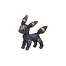
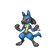
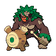
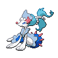
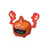

# 案C｜ブラッキー＋ルカリオZ・ボーマンダ：攻撃重視

**2026-09-18／チャンピオンズ・M-Cシングル／独自案・実戦未検証**

[3案の比較](recovery-options.md) ｜ [トップ](../README.md)

## 6匹の全設定

**ブラッキー／ルカリオ／ゴリランダー／アシレーヌ／ボーマンダ／ヒートロトム**

     

画像は通常姿の識別用。[画像出典](../assets/CREDITS.md)

## 育成前の確認

**↑＝その能力が上がりやすい、↓＝その能力が上がりにくい。** H＝HP、A＝攻撃、B＝防御、C＝特攻、D＝特防、S＝素早さ。ポイントは各能力0～32、合計66。技・配分・持ち物は提案設定で、写真の個体が設定済みという意味ではありません。種族の所持は写真で確認済みですが、メガストーン等の所持は未確認です。

ブラッキーの「ねがいごと」は翌ターン終了時の回復。自分を回復するなら「ねがいごと→まもる」、味方に渡すなら次ターンに通常交代します。交代先が攻撃を耐えられる場面だけで使い、苦手な攻撃へ無理に交代しません。イカサマは相手の攻撃を使うため、攻撃を下げる性格でも役割を持てます。

ゴリランダーは**グラスメイカー必須**。グラススライダーの先制を草フィールドなしで期待しないこと。ロトムは写真のおにびをトリックに変更する設定です。スカーフで技が固定されるため、電気技を地面タイプに止められる分岐も考えます。

| ポケモン | 持ち物 | 性格 | 特性 | 技4つ |
| --- | --- | --- | --- | --- |
| ブラッキー | たべのこし | ずぶとい（防御↑・攻撃↓） | せいしんりょく | イカサマ／ねがいごと／まもる／あくび |
| ルカリオ | ルカリオナイトZ | おくびょう（素早さ↑・攻撃↓） | せいしんりょく→はどうのぼうご | はどうだん／ラスターカノン／あくのはどう／わるだくみ |
| ゴリランダー | きせきのタネ | いじっぱり（攻撃↑・特攻↓） | グラスメイカー | グラススライダー／ウッドハンマー／はたきおとす／とんぼがえり |
| アシレーヌ | オボンのみ | ひかえめ（特攻↑・攻撃↓） | げきりゅう | うたかたのアリア／ムーンフォース／クイックターン／アンコール |
| ボーマンダ | ボーマンダナイト | ようき（素早さ↑・特攻↓） | いかく→スカイスキン | すてみタックル／じしん／りゅうのまい／はねやすめ |
| ヒートロトム | こだわりスカーフ | おくびょう（素早さ↑・攻撃↓） | ふゆう | オーバーヒート／10まんボルト／ボルトチェンジ／トリック |

| ポケモン | H | A | B | C | D | S | 合計 | 役割 |
| --- | ---: | ---: | ---: | ---: | ---: | ---: | ---: | --- |
| ブラッキー | 32 | 0 | 32 | 0 | 2 | 0 | 66 | 味方の回復・物理積みへの牽制 |
| ルカリオ | 2 | 0 | 0 | 32 | 0 | 32 | 66 | メガZ枠・高速特殊格闘 |
| ゴリランダー | 32 | 32 | 0 | 0 | 0 | 2 | 66 | 高速水への先制草技・交代 |
| アシレーヌ | 32 | 0 | 20 | 14 | 0 | 0 | 66 | 水・ドラゴンへの対応・特殊火力 |
| ボーマンダ | 2 | 32 | 0 | 0 | 0 | 32 | 66 | 別メガ枠・物理の勝ち筋・自己回復 |
| ヒートロトム | 2 | 0 | 0 | 32 | 0 | 32 | 66 | 炎打点・速度・交代 |

## この案の位置づけ

グソクムシャを使わない比較案です。以前のv2.0のサーフゴーをブラッキーへ替え、ねがいごとでルカリオZなどを支えます。**ねがいごと・はねやすめの2匹**。ルカリオZの高速特殊格闘とマンダの物理火力を相手に合わせて選びます。メガ2枠を登録しますが、基本はどちらか1匹を選出します。

## 選出と動かし方

| 相手・目的 | 選出候補3匹 | 方針 |
| --- | --- | --- |
| 特殊格闘を通す | ブラッキー＋ルカリオZ＋アシレーヌ | ブラッキーで回復支援。ただしルカリオを高火力特殊技へ投げない |
| 物理で崩す | ブラッキー＋ボーマンダ＋ヒートロトム | 威嚇と回復で消耗を抑え、マンダを通す。特殊水が強い相手には固定しない |
| 前に負けた6匹 | ゴリランダー＋ヒートロトム＋ルカリオZ | 水・グソク・ブリジュラスへの打点を分担。マンダが特に重ければ後ろ2匹の一方をアシレーヌへ |
| 高速水＋ドラゴン | ゴリランダー＋アシレーヌ＋ルカリオZ | 氷技持ちインテレオンにマンダを合わせず、草の先制打点を保つ |

### 苦手と戻す条件

電気無効・ステロ・設置除去がなく、サーフゴーの変化技耐性も失います。ブラッキーを相手のメガグソクの虫技や特殊格闘に居座らせないこと。ルカリオZの接触技軽減は非接触技や特殊技には使えません。マンダのじしんも、接地した相手へは草フィールドで半減します。回復しながら物理火力を出すグソクを使いたいなら案Aへ。

## 対戦前の注意・検証

インテレオンのれいとうビーム・ちょうはつはユーザー報告済み、水技は「ねらいうち？」で未確定。持ち物・4技目・特性は不明です。ブラッキーを挑発持ちへの万能な受けとして使いません。ゴリランダーも氷技を繰り返し受けられる保証はなく、HPとフィールドを管理します。

まず10戦ほど同じ案で、選出3匹・ねがいごとが成功した相手・回復できず倒れた場面・相手を倒せず負けた場面を記録。勝率の優劣を断定する試験ではなく、役割不足を見つけるための試行です。新しい組み合わせの全対面のダメージは未計算です。

## 参考

- [バトルデータベース：ブラッキー・M-6シングル](https://champs.pokedb.tokyo/pokemon/show/0197-00?season=6&rule=0)：ねがいごと・まもる型の採用傾向を参考。
- [バトルデータベース：グソクムシャ・M-6シングル](https://champs.pokedb.tokyo/pokemon/show/0768-00?season=6&rule=0)：鋼技・虫技・地面技、HPと攻撃に寄せる配分を参考。
- [Serebii：グソクムシャ](https://www.serebii.net/pokedex-champions/golisopod/)／[ブラッキー](https://www.serebii.net/pokedex-champions/umbreon/)：Championsの技・特性を確認。
- [Serebii：ルカリオの考察](https://www.serebii.net/potw-champions/448.shtml)：ルカリオZ・ゴリランダー・アシレーヌ等の組み合わせの参考。

公開データを参考に組み合わせた独自案で、実績付きの完成構築の転載ではありません。単体採用率をこの6匹の勝率とは扱いません。
