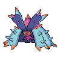

# ドヒドイデ入りサイクル案

**2026-09-18／チャンピオンズ・M-Cシングル／現在の優先候補**  
[トップ](../README.md) ｜ [前のサイクル案](cycle-team.md)

## おすすめの6匹

**ドヒドイデ／カバルドン／ヒートロトム／ボーマンダ／グソクムシャ／サーフゴー。**

前のサイクル案のアシレーヌをドヒドイデに変更。さいせいりょくで交代時に回復しながら、毒・ステロ・攻撃で削り、最後にメガ枠かサーフゴーで倒します。海外の図鑑で仕様を確認した独自案で、実績付き公開構築の転載ではありません。勝率・ダメージ調整は未検証です。

| サイクルの軸 | 電気への交代先 | 速度と炎打点 |
| :---: | :---: | :---: |
|  |  |  |
| さいせいりょく・毒・回復 | 電気無効・ステロ・回復 | スカーフ・ボルチェン |
|  |  |  |
| 地面無効・終盤のエース | 別のメガ枠・先制技 | 変化技への強さ・崩し |

画像は通常姿の識別用。[画像出典](../assets/CREDITS.md)

## ドヒドイデの設定

| 項目 | 試験設定 |
| --- | --- |
| 特性 | **さいせいりょく** |
| 持ち物 | **たべのこし**（カバルドンのゴツゴツメットと重複しない） |
| 性格 | **おだやか（特防↑・攻撃↓）** |
| 能力ポイント | **HP32・防御2・特防32＝66** |
| 技 | **なみのり／どくどく／くろいきり／じこさいせい** |

↑＝上がりやすい能力、↓＝上がりにくい能力。物理寄りのカバと役割を分けるため、特防寄りから試します。特定の攻撃を確定で耐える調整ではありません。物理への受け出しが多く、先に倒れる場合は、**ずぶとい（防御↑・攻撃↓）・HP32／防御32／特防2**と比較します。

[SerebiiのChampions図鑑](https://www.serebii.net/pokedex-champions/toxapex/)で、さいせいりょく（交代時に最大HPの約1/3回復）と上記4技を確認しました。なみのりは攻撃手段、どくどくは継続的な削り、くろいきりは能力変化の解除、じこさいせいは居座る必要がある場面の回復です。

**残り5匹は[前のサイクル案の設定表](cycle-team.md#6匹の試験設定)を使用。** アシレーヌの行だけを上記へ差し替えます。メガ枠は基本どちらか1匹を選出します。

## 交代先をどう決めるか

| ドヒドイデが呼ぶ攻撃・相手 | 交代先候補 | 注意 |
| --- | --- | --- |
| 電気技 | カバルドン | 相手の水・草・氷のサブウェポンを確認。電気無効だけで安全とは限らない |
| 地面技 | ボーマンダ／ヒートロトム | 岩・氷技や、ふゆうを無視する特性には注意 |
| エスパー技 | サーフゴー／メガグソクムシャ | 鋼の耐性を使う。グソクは**メガ前にはエスパー耐性がない** |
| サーフゴーなど毒が効かない相手 | ロトムなど攻撃役 | 毒や回復を繰り返して、わるだくみの隙を与えない |

逆に、カバが呼ぶ水技、鋼枠が呼ぶ炎技はドヒドイデの受け出し候補。ただし技の威力・相手の強化・残りHPを確認します。交代すれば回復する特性でも、出したターンに倒されたら回復できません。

## 基本選出

### 1. ドヒドイデ＋カバルドン＋ボーマンダ

**まず試す基本形。** 水・炎はドヒドイデ、電気はカバ、地面はマンダで補完し、毒・ステロで削ってマンダを通します。これはタイプ上の補完であり、相手の全技を受け切れる保証ではありません。

相手に鋼・毒などどくどくが効かないポケモンが多く、マンダも止められる場合は、この選出を避けます。ドヒドイデ＋カバの2匹だけでは崩す力が足りません。

### 2. ドヒドイデ＋ヒートロトム＋グソクムシャ

**交代技で攻撃を続けたい選出。** ロトムのボルチェン・グソクのとんぼから有利対面を作り、ドヒドイデで受けて引く。グソクのであいがしらを使い直す展開を狙います。

電気無効枠がいないため、相手のボルチェンを止められません。またロトムの高速ボルチェンでは、出した味方がそのターンの攻撃を受けます。

### 3. ドヒドイデ＋サーフゴー＋ボーマンダ

**回復と崩しを両立する選出。** ドヒドイデを止めに来る相手にサーフゴーのわるだくみ、物理受けが削れたらマンダの竜舞を狙います。電気への受け先は薄くなるため、相手次第でカバを優先します。

## 想定相手への方針

| 相手 | 方針 |
| --- | --- |
| カバマンダ | マンダへの毒、積みへのくろいきりを狙えるが、じしん持ちをドヒドイデだけで止めない。削れる前の対応が必要 |
| グソク中心 | 毒が効かないメガ後にはロトムの炎打点を残す。ドヒドイデで毎回完封できるとは考えない |
| ルカリオZ | スカーフロトムでの切り返しを優先。ドヒドイデへの特殊耐久投資だけで受け切れるとは断定しない |
| 雨・水アタッカー | 再生力のある水耐性を生かす。ただし地面・エスパー打点や強いゴースト技を持つ相手には注意 |
| 耐久構築 | サーフゴーのわるだくみ、ロトムのトリックを優先。ドヒドイデ＋カバだけで粘り続けない |
| ちょうはつ・みがわり | 毒・回復を止められる前に攻撃役へ。くろいきりは攻撃を耐えて使える場面でのみ切り返しになる |

## アシレーヌから替える代償

- **ドラゴン無効・フェアリー打点を失う。** ガブリアスなどへの水・妖の攻撃圧力も低下。鋼枠を残しても、地面技との打ち分けには注意。
- **クイックターン・アンコールを失う。** ドヒドイデは自分で交代技を使わず、通常交代で再生力を発動する。回復しながら交代できても、相手に自由な行動を与える場合がある。
- **毒とあくびが競合する。** 毒状態の相手は眠らせられない。毒で削る相手か、カバのあくびで流したい相手かを先に決める。
- **ステロ・まきびし、砂は残る課題。** ドヒドイデは接地した毒タイプなのでどくびしを回収できるが、他の設置技は除去しない。砂中はたべのこしの回復が相殺される。

まず10戦程度、「ドヒドイデが交代で回復できたか」「どの技で受けが崩れたか」「最後に相手を倒す役が残ったか」を記録。再生力が働いても勝ち筋が残らない場合は、受けをさらに増やさず攻撃枠を見直します。
